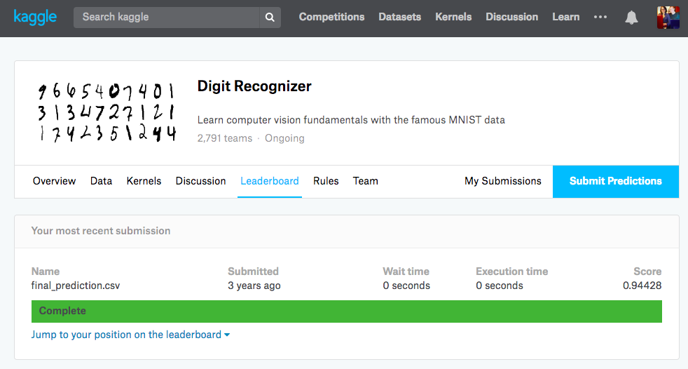

```{r setup, include=FALSE}
knitr::opts_chunk$set(echo = TRUE)
```

## Assignment

The handwritten digits data we used in the classification slides is a very famous machine learning dataset. A lot of different ways to classify the data are on the [kaggle competition page](https://www.kaggle.com/c/digit-recognizer). 

I've randomly assigned you to two teams: 

```{r sample}
students <- c("Alese", "Badiah", "Carley", "Da'Monie", "Malisha", "Yolonda")
# Team 1 
set.seed(982632)
team1 <- sample(students, 3)
team2 <- setdiff(students, team1)
team1
team2
```

Your assignment is to work in your teams to perform the best you possibly can at the kaggle competition. You'll need to create Kaggle accounts to do this. (You can each create one or you can create one per team.)

Whichever team builds the best model according to kaggle will be the winner. The winning team will get one baked good of their choice made by me. 

To indicate you are done with the competition, you need to email me the code you used to create the model (so that I can reproduce your results) and a screenshot of your kaggle score by 5pm on Tuesday, July 3rd. Do NOT communicate about this assignment with the other team! 

Kaggle has things called "Kernels" that contain others' work that will help you get started with different models to fit. 

**Bonus:** Here's my score from when I did this 3 years ago. I bet you can beat me! (A perfect score is 1)


