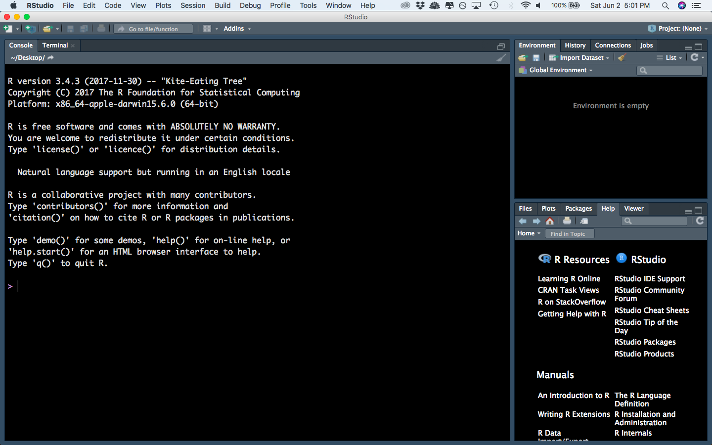
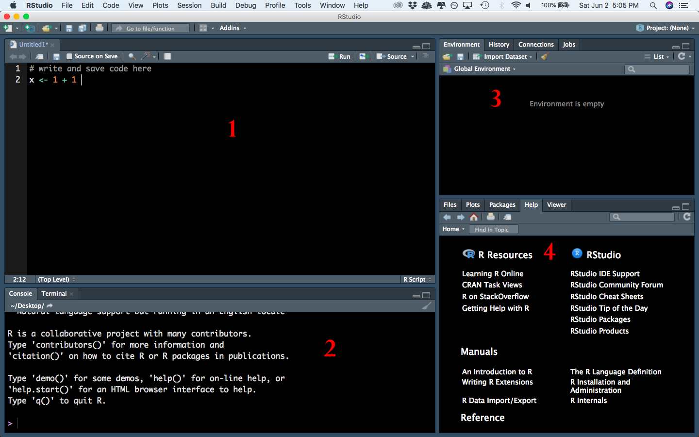
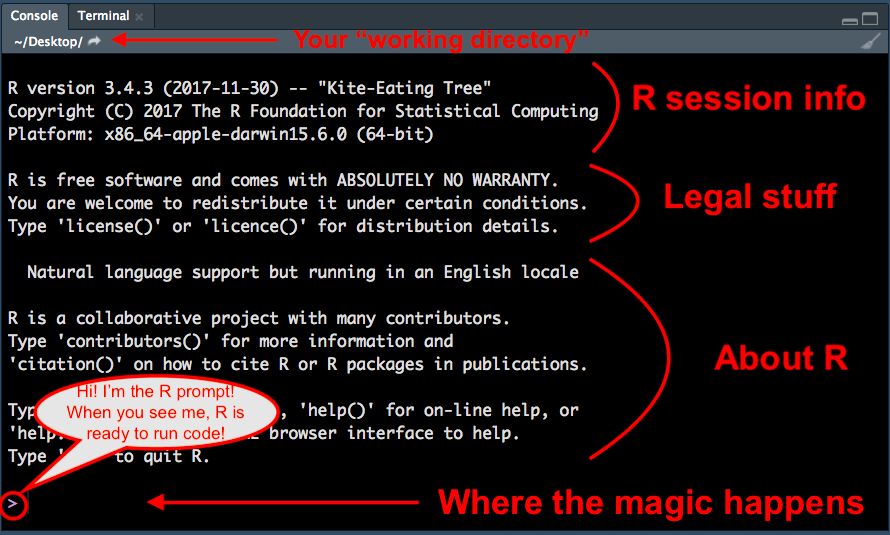

```{r setup, include=FALSE}
options(htmltools.dir.version = FALSE)
```

class: primary
# Open RStudio



---
class: secondary

.small[
RStudio is divided into 4 panes: 
]



---
class: primary
# Panes

1. Source - these are files. You edit them here. You can run code from source files.
2. Console - where the program `R` "lives." When you run code, it is executed here. The results also print out here. 
3. Environment and others - the Environment tab shows you what variables and values you have stored in your R session. This is the only relevant tab for now. 
4. Files, Plots, Help, and others

    a. The Files tab navigates through files on your computer. You can open any file from there. 
    
    b. The Plots tab shows you any plot that you've created in `R`. (Note: it does NOT save the plot automatically)
    
    c. The Help tab lets you search for functions, topics, etc. to get help
    
---
class: primary 
# Your Turn 1.1

1. Create a new folder on your computer called "LearningR". Make sure you put it somewhere you can easily find it. 
2. In RStudio, create a new R script. Type "# hello R" in the first line. Save the file as "01-basics.R" in the LearningR folder. 

---
class: primary
# Get to know panes 1, 2

In pane 1 (the source) type `1 + 1` and hit Ctrl+Enter

What happens? 

---
class: primary
# Get to know panes 1, 2

In pane 1 (the source) type `x <- 1 + 1` and hit Ctrl+Enter

What happens? 

---
class: primary
# Get to know panes 1, 2

In pane 2 (the console) type `2+2` and hit Enter

What happens? 

---
class: primary
# Get to know panes 1, 2

In pane 2 (the console) type `y <- 2+2` and hit Enter

What happens? 

---
class: primary
# The `<-` operator

In `R`, we call `<-` "the assignment operator" 

Think of it like an arrow: you are assigning whatever is on the right side of the arrow to the variable name on the left side of the arrow. 

You can see what value is assigned to a variable name in 2 primary ways:

1. Type the name of the variable (e.g. `x` or `y`) in the console and hit Enter. You will see the value of the variable print out.
2. In the Environment tab in pane 3. 

---
class: primary
# More console



---
class: primary
# Vectors

A **vector** is a bunch of values all strung together in one object

Any object that stores data in `R` is called a **data structure**. 

A **numeric vector** is a very simple type of data structure. 

Let's create a small numeric vector with the function `c()`. The c stands for "combine". It takes the objects between the parentheses and makes them one object, a vector. 

```
z <- c(x, y, 14, 1.5, pi, e)
```