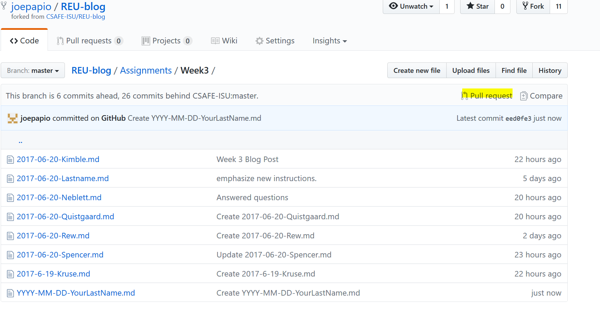
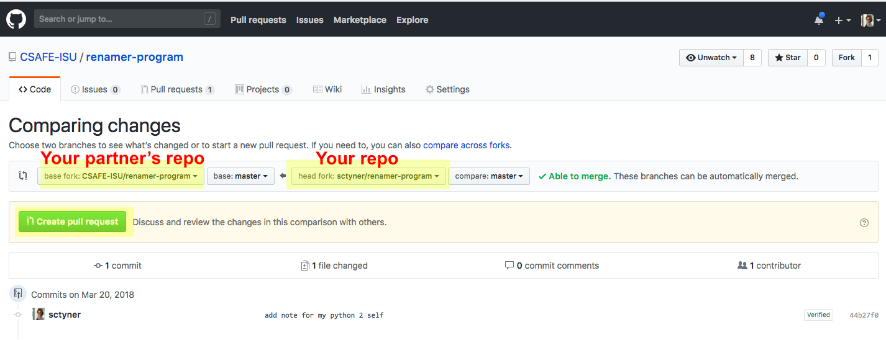
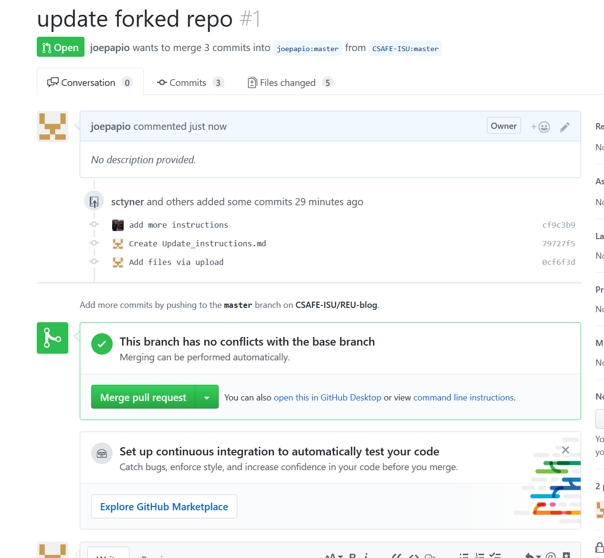

```{r setup, include=FALSE}
options(htmltools.dir.version = FALSE)
```

class: primary
# Collaboration

- Github is primarily used for collaboration on software projects
- Can also collaborate on websites, presentations, etc
- All types of files can live on Github. 

---
class: primary
# Partner up

1. Pair up with another person
2. Each of you should create a new repository on Github (name it whatever you like)
3. Fork your partner's repo. [How to fork](https://guides.github.com/activities/forking/)
4. Clone your fork of your partner's repo by creating a new RStudio project. (Save it to the `tmp` folder again)
5. Make a change in the local repo.
6. Push the change to Github. 

---
class: primary
# Submit your change

Next, you'll need to submit your change for your partner's approval. 

1. On your forked Github repo, click pull request. 



---
class: secondary

- Make sure you're submitting your changes to your partner's repo. 



---
class: primary
# Approve change 

Now, once your partner has submitted a change, you have to approve it. 

On your repo, you should see a tab that says "Pull Requests" that should have a 1 next to it. Click there. Then, click the big green "Merge Pull Request" button. 




