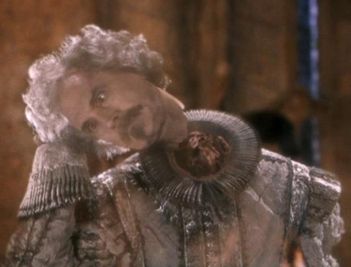

```{r setup, include=FALSE}
knitr::opts_chunk$set(echo = FALSE, message = FALSE, warning = FALSE, fig.align = 'center', fig.width = 6, cache=T)
```

```{r loadpkgs}
library(tidyverse)
```

class: primary
# Textbook

These slides are based on the book *OpenIntro Statistics* by David Diez, Christopher Barr, and Mine Çetinkaya-Rundel

The book can be downloaded from [https://www.openintro.org/stat/textbook.php](https://www.openintro.org/stat/textbook.php)

Part 3 Corresponds to Chapter 3 of the text. Sections 3.1-3.3 correspond to sections 3.1, 3.4, 3.5.2 of the text.

---
class: primary
# Outline 

- Normal distribution (3.1)
- Binomial distribution (3.2)
- Poisson distribution (3.3)

---
class: inverse
#  Section 3.1: The Normal Distribution

---
class: primary
# The "Bell Curve"

- The normal distribution AKA the bell curve AKA the Gaussian distribution is the most well-know statistical distribution outside of statistics 
- Key properties: Symmetric and Unimodal

```{r norm, fig.height=3.5, out.width='.75\\linewidth'}
ggfortify::ggdistribution(dnorm, seq(-3,3, .01), mean = 0, sd = 1) + theme_bw() + 
  theme(axis.text.y = element_blank())
```

---
class: primary
# Wrong and Useful

- Famous quote by George Box: "All models are wrong but some are useful". Normal distribution is no exception. 
- Many variables are *nearly* normal, but none are exactly normal. 
- The normal distribution, while not perfect for any single problem, is very useful for a variety of problems. 

--



Like Nearly Headless Nick, the normal distribution isn't perfect, but it gets the job done.

---
class: primary
# Formula 

If the variable $X$ is distributed normal with mean $\mu$ and variance $\sigma^2$, we write 

$$X \sim N(\mu, \sigma^2)$$

The probability density function of the variable $X$ is 

$$f(x | \mu, \sigma) = \frac{1}{\sqrt{2\pi \sigma^2}} \exp\left\{ - \frac{(x-\mu)^2}{2\sigma^2}\right\}$$


---
class: primary
# Mean, Variance

- The mean parameter, $\mu$, determines the *center* of the distribution. A peak (or mode) occurs at $\mu$
- The variance parameter, $\sigma^2$, determines the *spread* of the distribution 
- If we know that $X$ is normal, and we know the values of $\mu$ and $\sigma$, we know everything there is to know about $X$.
- $\mu$ and $\sigma$ are called the **parameters** of the distribution. 

```{r normdists, fig.height=3, out.width='.75\\linewidth'}
x <- seq(-5,5, .01)
x2 <-  seq(0, 36, .1)
y <- dnorm(x)
y2 <- dnorm(x2, mean = 21, sd = 5)

ggplot() + 
  geom_line(data = NULL, aes(x = x, y = y), color = "red") + 
  geom_line(data = NULL, aes(x = x2, y = y2), color = "green") +
  theme_bw() + 
  labs(x = "Values of the variables X, Y", y = "Density", title = "Normal Distributions",
       subtitle = "X (red): center = 0, spread = 1. Y (green): center = 21, spread = 25")
```

---
class: primary
# Standard Normal

The **standard normal distribution** denoted $Z$, is the normal distribution with $\mu = 0$ and $\sigma^2 = 1$. 

- All normal random variables can be written in terms of $Z$
- For $X$ with mean $\mu$ and variance $\sigma^2$: 
$$X = \mu + Z \times \sigma$$

- For any observation $x$ of a normally distributed random variable $X$ with mean $\mu$ and variance $\sigma^2$ can be written as an observation from $Z$: 
$$z = \frac{x - \mu}{\sigma}$$

- Known as the $z$-score of an observation. It is the number of standard deviations the observation is away from the mean. 

---
class: primary
# $z$-scores 

- Tells you how "different" an observation is from the mean 
- $z$-scores less than 0 are below the mean, $z$-scores greater than 0 are above the mean. $z$-score of 0 means that $x = \mu$. 
- Observations with higher $z$-scores (in absolute value) are "more unusual" than observations with lower $z$-scores (in absolute value)

**The 68-95-99.7% Rule** 

- About 68% of observations have an absolute $z$-score less than 1
- About 95% of observations have an absolute $z$-score less than 2
- About 99.7% of observations have an absolute $z$-score less than 3
- $z$-scores of 3 or more are considered very unusual

---
class: primary
# Is it normal?

- Histogram: approximately symmetric, only one mode 
- QQPlot: Do the data fall on the line? (Do they match with theoretical quantiles?)

```{r qqplot, fig.height=5}
glass <- read_csv("dat/glass_sample.csv")
dat <- filter(glass, mfr == "M2") %>% select(Fe57)
y     <- quantile(dat$Fe57, c(0.25, 0.75), type=5) # Find the 1st and 3rd quartiles
x     <- qnorm( c(0.25, 0.75))                 # Find the matching normal values on the x-axis
slope <- diff(y) / diff(x)                     # Compute the line slope
int   <- y[1] - slope * x[1]  
p1 <- ggplot(data = dat) + geom_histogram(aes(x = Fe57), binwidth = 3.5, fill = 'white', color = 'black') + theme_bw() + theme(aspect.ratio = 1)
p2 <- ggplot(data = dat, y = Fe57) +
  stat_qq(aes(sample = Fe57), size = .5) + 
  geom_abline(slope = slope, intercept = int) + 
  theme_bw() + theme(aspect.ratio = 1, text = element_text(size=rel(3)))
gridExtra::grid.arrange(p1, p2, nrow = 1)
```

---
class: primary
# Your Turn 3.1.1

The Graduate Record Examination (GRE) is mandatory for many graduate school applications, similar to the ACT/SAT for college applications. A student scored 160 on the Verbal Reasoning (VR) section and 157 on the Quantitative Reasoning (QR) section. The mean score for VR section for all test takers was 151 with a standard deviation of 7, and the mean score for the QR was 153 with a standard deviation of 7.67. Suppose that both distributions are nearly normal.

1. Write down the short-hand for these two normal distributions.
2. What is the student's $z$-score on the Verbal Reasoning section? On the Quantitative Reasoning
section? 
3. Relative to others, which section did the student do better on?
4. Explain why simply comparing raw scores from the two sections could lead to an incorrect
conclusion as to which section a student did better on.

---
class: primary
# YT 3.1.1 (soln.)


.small[The Graduate Record Examination (GRE) is mandatory for many graduate programs, similar to the ACT/SAT for college applications. A student scored 160 on the Verbal Reasoning (V) section and 157 on the Quantitative Reasoning (Q) section. The mean score for the V section for all test takers was 151 with a standard deviation of 7, and the mean score for the Q section was 153 with a standard deviation of 7.67. Suppose that both distributions are nearly normal.]

1. Write down the short-hand for these two normal distributions. $V\sim N(151, 7); Q\sim N(153, 7.67)$ 
2. What is the student's $z$-score on the Verbal Reasoning section? On the Quantitative Reasoning
section? $V: z = \frac{160 - 151}{7} = 1.286$, $Q: z = \frac{157 - 153}{7.67} = 0.522$
3. Relative to others, which section did the student do better on? .red[The verbal reasoning section. (Higher $z$-score.)]
4. Explain why simply comparing raw scores from the two sections could lead to an incorrect 
conclusion as to which section the student did better on. .red[Without knowing the underlying distribution of scores, we cannot know how they did relative to others.]

---
class: primary
# Your Turn 3.1.2 

.small[
Below are final exam scores of 20 Introductory Statistics students: 

57, 66, 69, 71, 72, 73, 74, 77, 78, 78, 79, 79, 81, 81, 82, 83, 83, 88, 89, 94

1. The mean score is 77.7 points, with a standard deviation of 8.44 points. Use this information to determine if the scores approximately follow the 68-95-99.7% Rule.
2. Do these data appear to follow a normal distribution? Explain your reasoning using the graphs provided below.
]

```{r yourturn312, fig.height=5}
dat <- data.frame(x = c(57, 66, 69, 71, 72, 73, 74, 77, 78, 78, 79, 79, 81, 81, 82, 83, 83, 88, 89, 94))

y     <- quantile(dat$x, c(0.25, 0.75), type=5) # Find the 1st and 3rd quartiles
x     <- qnorm( c(0.25, 0.75))                 # Find the matching normal values on the x-axis
slope <- diff(y) / diff(x)                     # Compute the line slope
int   <- y[1] - slope * x[1]  

p1 <- ggplot(data = dat) + 
  geom_histogram(aes(x = x, y = ..density..), binwidth = 5, fill = 'white', color = 'black', center= 2.5) + 
  geom_density(aes(x = x)) + 
  theme_bw() + theme(aspect.ratio = 1, text = element_text(size=rel(5)))
p2 <- ggplot(data = dat, y = x) +
  stat_qq(aes(sample = x)) + 
  geom_abline(slope = slope, intercept = int) + 
  theme_bw() + theme(aspect.ratio = 1, text = element_text(size=rel(5)))
gridExtra::grid.arrange(p1, p2, nrow = 1)
```

---
class: primary
# YT 3.1.2 (soln.)

.small[ 

Below are final exam scores of 20 Introductory Statistics students: 

.purple[57], .green[66, 69], .blue[71, 72, 73, 74, 77, 78, 78, 79, 79, 81, 81, 82, 83, 83], .green[88, 89, 94]

1. The mean score is 77.7 points, with a standard deviation of 8.44 points. Use this information to determine if the scores approximately follow the 68-95-99.7% Rule. .red[They do follow the rule:] 
.blue[77.7 +/- 8.44 = (69.26, 86.14) ,14/20 = 70%]
.green[77.7 +/- 2 x 8.44 = (60.82, 94.58), 19/20 = 95%] 
.purple[77.7 +/- 3 x 8.44 =(52.38, 103.02), 20/20=100%]
2. Do these data appear to follow a normal distribution? Explain your reasoning using the graphs provided below. .red[With the exception of a low outlier (57), the histogram is unimodal and symmetric and the points approximately follow the line in the QQ plot. So the data are approximately normal.]
]


---
class: inverse
# Section 3.2: The Binomial Distribution

---
class: primary
# Binary trials

- A variable is **binary** if there are only 2 disjoint outcomes
- The 2 outcomes are \{success, failure\}.
- A "success" is assigned a 1, and a "failure" is assigned a 0
- Defined as you choose! 
- Example: "Succes" is a juror returning a verdict of "guilty" while a failure is a juror returning a verdict of "not guilty"
- Notation for binary variables: 
$$X = \begin{cases} 1 & \text{if juror returns guilty verdict} \\ 0 & \text{if juror returns not guilty verdict} \end{cases}$$

---
class: primary
# Probability in binary trials

- If $X$ is a random binary process, then we can write it in terms of the probability of success $p$.
- $p = P(X = 1)$
- $P(X = 0) = 1- p$
- Expected value: $E[X] = p$
- Variance: $Var(X) = p(1-p)$

---
class: primary
# Many independent binary trials

- Suppose the probability of a juror giving a guilty verdict is 0.1
- Suppose we have 12 jurors on a jury, and we assume they are independent (though this is not actually true)
- What is the probability of a guilty verdict? (All 12 jurors agree the defendant is guilty)

Each juror's verdict can be written as a random binary variable: $X_1, X_2, \dots, X_{12}$. $X_i = 1$ if juror $i$ says "guilty", and is 0 if "not guilty". We want $X_1 = 1, X_2 = 1, \dots, X_{12}=1$ 

- $p = 0.1$
- Write: $P(X_1 = 1, X_2 = 1, \dots, X_{12}=1) = P(X_1 = 1) \times P(X_2 = 1) \times \cdots \times P(X_{12} = 1) = (0.1)^{12}$
- Thus, $P(X_1 = 1, X_2 = 1, \dots, X_{12}=1) = 10^{-12}$

---
class: primary
# Binomial Distribution 

Let $X$ be a random variable that has a binomial distribution. 

The **binomial distribution** describes the probability of having exactly $x$ successes in $n$ independent binary trials with probability of a success $p$. The formula is: 

$$P(X = x) = \binom{n}{x} p^x (1-p)^{n-x}$$

- $n$: the number of independent binary trials
- $p$: the probability of success
- $x$: the number of successes
- $1-p$: the probability of failure
- $n-x$: the number of failures 
- $\binom{n}{x}$: the number of ways to choose which of the $n$ trials will be the $x$ successes

---
class: primary
# Sidetrack: combinations 

- Combinitions operation: $\binom{n}{k}$ is read as " $n$ choose $k$". This is the number of ways to choose $k$ observations from $n$ things. (Note that order doesn't matter. Choosing {1,2} from {1,2,3} is the same as choosing {2,1}.)  
- $\binom{n}{k} = \frac{n!}{k!(n-k)!}$
- Factorial: $n! = n \times (n-1) \times (n-2) \times \cdots \times 2 \times 1$ 
- Example: Flip a coin 4 times. How many ways are there to get two tails? 
- $\binom{4}{2} = \frac{4!}{2!(4-2)!} = \frac{4\cdot 3 \cdot 2 \cdot 1}{2 \cdot 1 \times 2\cdot 1} = 3 \cdot 2 \cdot 1 =6$

```{r coins, results='asis'}
dat <- data.frame(expand.grid(one = c("H", "T"), two = c("H", "T"), three = c("H", "T"), four = c("H", "T")))
dat2 <- dat %>% mutate(isH = (one == "H") + (two == "H") + (three == "H") + (four == "H"), lab = paste0(one, two, three, four), color = ifelse(isH == 2, paste0(".red[", lab, "]"), lab)) 
knitr::kable(matrix(dat2$color, nrow = 4), col.names = NULL, format = 'html', caption = "All possible outcomes for flipping a coin 4 times")
```

---
class: primary
# Binomial Dist. Example

- Flip a coin 4 times: what is the probability that there will be exactly 2 heads? 

--

- $n = 4; x = 2, p = .5$ 

--

- $P(X = 2) = \binom{4}{2} \cdot 0.5^2 \cdot 0.5^2 = 0.375$

--

```{r coins2, results='asis'}
dat <- data.frame(expand.grid(one = c("H", "T"), two = c("H", "T"), three = c("H", "T"), four = c("H", "T")))
dat2 <- dat %>% mutate(isH = (one == "H") + (two == "H") + (three == "H") + (four == "H"), lab = paste0(one, two, three, four), color = ifelse(isH == 2, paste0(".red[", lab, "]"), lab)) 
knitr::kable(matrix(dat2$color, nrow = 4), col.names = NULL, format = 'html')
```

--

- In all 16 outcomes of 4 rolls, there are 6 where there are exactly 2 heads. 6/16 = 0.375

---
class: primary
# Binomial variables: Review

```{r binom2, fig.height = 2, out.width= ".75\\linewidth"}
x <- 0:4
y <- dbinom(x, 4, .5)
ggplot(data = NULL) + geom_bar(aes(x = x, weight = y)) + theme_bw()+ labs(x = "How many heads in 4 coin flips", y = "Probability of outcome", title="Binomial Distribution for n = 4, p = .5")
```

1. A fixed number ( $n$ ) of binary trials
2. The trials are independent 
3. Each trial is either a "success" or a "failure"
4. The probability of a "success" ( $p$ ) is the same for all trials 

---
class: primary
# Your Turn 3.2.1

Determine if each trial below can be considered an independent binary trial for the following situations.

1. Cards dealt in a hand of poker. 
2. Outcome of each roll of a die.


---
class: primary
# YT 3.2.1 (soln.)

Determine if each trial below can be considered an independent binary trial for the following situations.

1. Cards dealt in a hand of poker.  .red[No. The hands are not independent because hands are dealt without replacement from the deck.]
2. Outcome of each roll of a die. .red[Yes, if we can define the definitions of success and failures. e.g. success = odd number, failure = even number. The rolls are independent.]

---
class: primary
# Your Turn 3.2.2

.small[Data collected by the Substance Abuse and Mental Health Services Administration (SAMSHA) suggests that 69.7% of 18-20 year olds consumed alcoholic beverages in 2008.]

1. Suppose a random sample of ten 18-20 year olds is taken. Is the use of the binomial distribution appropriate for calculating the probability that exactly six consumed alcoholic beverages? Explain.
2. Calculate the probability that exactly 6 out of 10 randomly sampled 18- 20 year olds consumed an alcoholic drink.
3. What is the probability that exactly four out of ten 18-20 year olds have not consumed an alcoholic beverage?
4. What is the probability that at most 2 out of 5 randomly sampled 18-20 year olds have consumed alcoholic beverages?
5. What is the probability that at least 1 out of 5 randomly sampled 18-20 year olds have consumed alcoholic beverages?

**Hint**: The `R` command `dbinom(x,n,p)` will return the probability that there will be `x` successes out of `n` trials with probability of success equal to `p`.

---
class: primary
# YT 3.2.2 (soln.)

.small[

Data collected by the Substance Abuse and Mental Health Services Administration (SAMSHA) suggests that 69.7% of 18-20 year olds consumed alcoholic beverages in 2008.

1. Suppose a random sample of ten 18-20 year olds is taken. Is the use of the binomial distribution appropriate for calculating the probability that exactly six consumed alcoholic beverages? Explain. .red[Yes. There are a fixed number of trials (n=10), they are independent (randomly chosen), each trial is a success or failure (drank or not), and they have the same probablility of success (p=0.697) ]
2. Calculate the probability that exactly 6 out of 10 randomly sampled 18- 20 year olds consumed an alcoholic drink. .red[Solution:] $P(X=6) = \binom{10}{6} 0.697^6 (1-0.697)^{10-6} = 0.203$
3. What is the probability that exactly four out of ten 18-20 year olds have not consumed an alcoholic beverage? .red[Same as 2]
4. What is the probability that at most 2 out of 5 randomly sampled 18-20 year olds have consumed alcoholic beverages? .red[Solution:] $P(X \leq 2) = \sum_{x=0}^2 \binom{5}{x} 0.697^x (1-0.697)^{5-x}$ .red[= 0.167]
5. What is the probability that at least 1 out of 5 randomly sampled 18-20 year olds have consumed alcoholic beverages? .red[Solution:] $P(X \geq 1) = 1 - P(X = 0)= 1- \binom{5}{0} 0.697^0 (1-0.697)^{5-0} = 1- 0.0026$ .red[= 0.9974]
]

---
class: inverse
# Section 3.3: The Poisson Distribution 

---
class: primary
# Poisson distribution

The **Poisson distribution** is used for estimating the number of events in a large population over a unit of time.

Need to have: 

- fixed population 
- independent observations 
- fixed amount of time 
- known rate of the event occurring 

The **rate** of a Poisson distribution (denoted $\lambda$) is the average number of occurrences in a fixed population per unit of time

---
class: primary
# Definition of Poisson

- Suppose we are watching for events, and the number of observed events, $X$, follows a Poisson distribution with rate $\lambda$. Then, 
$$P(X = x) = \frac{\lambda^x\cdot \exp(-\lambda)}{x!}$$

- $x = 0, 1, 2, 3, \dots$

- Mean = $\lambda$, Variance = $\lambda$

---
class: primary
# Example of Poisson 

- Robberies occur in Atlanta, GA at a yearly rate of 429 per 100,000. 
- That is about 1.17 robberies per day per 100,000 people
- There are about 465,000 people living in Atlanta. 
- That is a rate of about $1.17 \times 4.65 = 5.44$ robberies per day. 
- Let $X=$ the number of that will occur tomorrow in Atlanta. $X \sim \text{Poisson}(\lambda)$ where $\lambda = 5.44$. 
- $E[X] = \lambda = 5.44$, $Var(X) = \lambda = 5.44$
- Probability distribution: 

```{r pois, fig.height=2, out.width = ".75\\linewidth"}
x <- 0:15
y <- dpois(x, lambda = 5.44)
ggplot() + 
  geom_bar(aes(x = x, weight = y), color = 'black', fill = 'white') +
  theme_bw()
```

---
class: primary
# Summary: Poisson

A random variable that follows the Poisson distribution if 

- It is concerned with the number of events
- The population that generates such events is large 
- The events occur independently of each other.

---
class: primary
# Your Turn 3.3.1 

A coffee shop serves an average of 75 customers per hour
during the morning rush. Assume the number of customers in the morning follows a Poisson distribution. 

1. What are the mean and the standard deviation of the number of customers this coffee shop serves in one hour during this time of day?
2. Would it be considered unusually low if only 60 customers showed up to this coffee shop in one hour during this time of day?
3. Calculate the probability that this coffee shop serves 70 customers in one hour during this time of day.

**Hint:** The `R` function `dpois(x,l)` calculates the probability that `x` events will occur when the mean of the Poisson is `l`. 

---
class: primary
# YT 3.3.1 (soln.)

A coffee shop serves an average of 75 customers per hour
during the morning rush. Assume the number of customers in the morning follows a Poisson distribution. 

1. What are the mean and the standard deviation of the number of customers this coffee shop serves in one hour during this time of day? 
.red[Solution:] Mean = 75, SD = $\sqrt{75}$ = 8.66
2. Would it be considered unusually low if only 60 customers showed up to this coffee shop in one hour during this time of day? 
.red[Solution:] $\frac{60-75}{8.66} = -1.73$. .red[Less than 2 standard deviations away from the mean. Not very unusual.]
3. Calculate the probability that this coffee shop serves 70 customers in one hour during this time of day? 
.red[Solution] $P(X= 70) = \frac{75^{70}\cdot \exp(-75)}{70!} = 0.04$